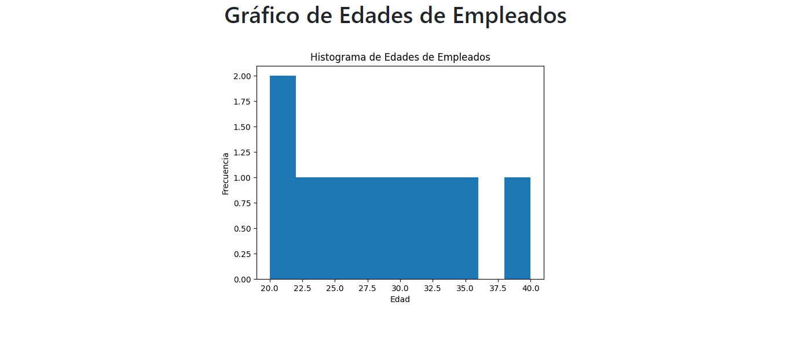
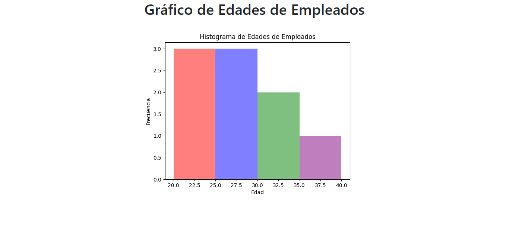

#   Gráfico de Edades de Empleados
<p aling="center">
    
</p>


##  Ejemplo 2 con colores y rangos:
```py
from flask import Flask, render_template
import matplotlib.pyplot as plt
import io
import base64

app = Flask(__name__)

@app.route("/")
def index():
    edades = [20, 21, 22, 25, 27, 29, 31, 33, 35, 40]
    colores = ["red", "blue", "green", "purple", "orange", "yellow", "brown", "grey", "pink", "violet"]
    rango = [20, 25, 30, 35, 40]

    fig, ax = plt.subplots()

    for i in range(len(rango)-1):
        edades_bin = [edad for edad in edades if edad >= rango[i] and edad < rango[i+1]]
        ax.hist(edades_bin, bins=1, range=(rango[i], rango[i+1]), alpha=0.5, color=colores[i])

    plt.xlabel("Edad")
    plt.ylabel("Frecuencia")
    plt.title("Histograma de Edades de Empleados")

    buf = io.BytesIO()
    plt.savefig(buf, format="png")
    buf.seek(0)
    plot = base64.b64encode(buf.read()).decode("utf-8")
    return render_template("index.html", plot=plot)

if __name__ == "__main__":
    app.run()
```
### Resultado
<p aling="center">
    
</p>


##  Proceso de creación del proyecto:
1. Crea un directorio para tu proyecto, por ejemplo, `graficos_flask`

2. Accede al directorio desde la terminal de Windows y crea un ambiente virtual de Python con el siguiente comando:
`python -m venv venv`

3. Activar el ambiente virtual con el siguiente comando:
`venv\Scripts\activate` <br>
Por consola nos mostrara que emos accedido a `(venv)`

4. Instala Flask y Matplotlib en el ambiente virtual:
`pip install flask matplotlib` <br>
Si ejecutamos `pip list` visualizaremos a manera de lista las librerias instaladas

5. Crea un archivo `app.py` y crear el código en Python:

6. Crear la carpeta `templates` y crear el archivo `index.html` y su respectivo código

7. Una vez activado **(venv)** Ejecutar el siguiente comando para iniciar la aplicación Flask:
`python app.py`

8. Abre un navegador web y accede a la dirección http://localhost:5000/ <br>
Verás la página web con el gráfico generado por Matplotlib.
